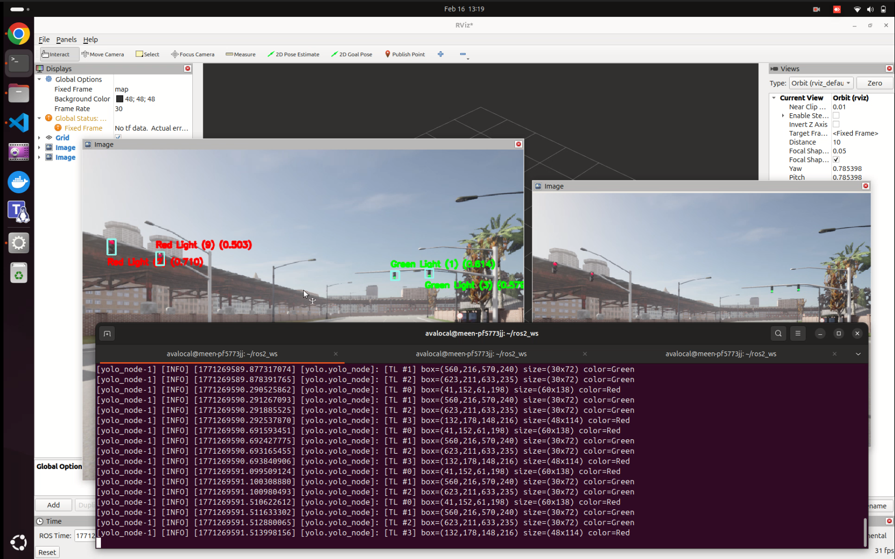

# Integrated YOLO_ROS with Custom Trained YOLO Model and Traffic Light Color Classification

This project integrates a custom trained YOLO model into ROS 2 for real time object detection and adds a classical computer vision based traffic light color classification system. The node detects objects such as traffic lights, signs, cones, and other road elements, and also determines the traffic light state as Red, Yellow, Green, or Unknown.

The main goal of this system is to provide a complete perception pipeline that can be used for autonomous driving research, simulation, and robotics projects.

[](https://drive.google.com/file/d/1xgzN1hMIn3-2maedNHSTKO0GwaCegOs0/view?usp=drive_link)

## Key Features
- ROS 2 lifecycle based YOLO detection node
- Supports custom trained YOLO models
- Real time object detection
- Traffic light color classification using HSV color filtering
- Bounding box expansion and ROI upscaling for accurate far distance classification
- Fully integrated into ROS 2 message pipeline
- Works seamlessly with rosbag playback and RViz visualization

## How Traffic Light Classification Works
1. YOLO detects traffic lights and outputs bounding boxes
2. Bounding boxes are expanded to capture more visual information
3. Region of interest is extracted and upscaled
4. Image is converted to HSV color space
5. Pixel masking is applied to detect red, yellow, and green regions
6. Pixel counts are compared to classify the dominant color

## System Requirements
- Ubuntu 20.04 or newer
- ROS 2 Humble or Iron
- Python 3.8+
- OpenCV
- PyTorch
- Ultralytics YOLO
- RViz2

## How to Run
### Terminal 1: Launch YOLO Node
```bash
conda deactivate
cd ~/ros2_ws
rosdep install --from-paths src --ignore-src -r -y
colcon build
source install/setup.bash

ros2 launch yolo_bringup yolov9.launch.py \
input_image_topic:=/carla/ego_vehicle/rgb_front/image \
model:=/home/avalocal/ros2_ws/yolov9_custom_model_with_signs_and_cones.pt \
device:=cpu
```

### Terminal 2: Play Rosbag
```bash
ros2 bag play <rosbag path>
```

### Terminal 3: Visualization
```bash
rviz2
```

## Output Topics
- /yolo/dbg_image: Publishes IMage for visualization with the detections and bounding boxes and classifications
- /yolo/detections: Publishes full detection results including class ID, class name, confidence score, bounding box, and traffic light color in extra_info

## Notes
- Bounding box expansion and ROI scaling are critical for accurate traffic light color detection at long distances
- Best bounding box scale factor is typically between 1.4 to 1.8
- ROI upscaling improves HSV color filtering reliability
